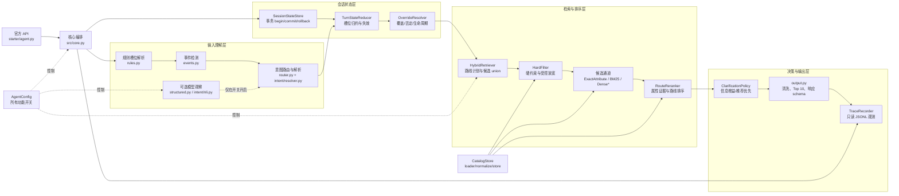

# Hamburgerr 项目结构、测试路径与检索优化分析

本文基于当前工作区代码、`phase4_module_experiment_report.md`、D0-D5 检索诊断 JSON、README 和测试套件整理。指标均来自本地 `data/public_set.jsonl` 的 200 个会话；除特别注明外，`Hit@10`、MRR、MTTC 和 TechnicalScore 使用同一评分逻辑。D0-D4 的响应延迟来自检索诊断基准，Phase 4 模块消融使用另一层实验包装器，因此延迟只能在同一系列内比较。

## 1. 项目规模与入口

确定性文件扫描结果：108 个文件，代码 78 个、文档 18 个、配置 12 个；语言为 Python 75、Markdown 17、JSON 12、JSONL 3、TXT 1；复杂度评估为 `moderate`。官方入口始终是 `starter.agent.Agent`，外部协议只有 `reset()` 和 `respond()`。



图中 `Dense*` 和 `OPTIONAL` 都是可选分支；当前发布配置关闭 Dense、LLM 和 active NLI。核心主路径是“规则理解 -> 事务状态 -> 硬过滤/属性检索 -> 确定性重排 -> 澄清/推荐 -> Top 10 输出”。

### 1.1 Agent 核心目录结构

```text
Hamburgerr/
├─ starter/                         # 官方适配层，不承载业务策略
│  └─ agent.py                      # Agent.reset/respond -> ShoppingAgentCore
├─ src/
│  ├─ core.py                       # 单次 respond 的事务编排与安全回退
│  ├─ config.py                     # AgentConfig、开关、模型/延迟预算
│  ├─ models.py                     # SessionState、Candidate、ParsedTurn 等类型
│  ├─ errors.py                     # AgentError 与错误码
│  ├─ output.py                     # 响应 schema、候选清洗、Top 10 限制
│  ├─ catalog/
│  │  ├─ loader.py                  # JSONL 读取
│  │  ├─ normalize.py               # canonical 字段、别名、缺失字段处理
│  │  └─ store.py                   # 只读 catalog 索引与 parent_asin 查找
│  ├─ nlu/
│  │  ├─ rules.py                   # 规则槽位解析与短答案绑定
│  │  ├─ structured.py              # 规则回退 + 可选 DeepSeek 结构化解析
│  │  ├─ events.py                  # override/clear/negation/intent_switch
│  │  ├─ router.py                  # Buying/Browsing/Unknown 规则路由
│  │  └─ intent/
│  │     ├─ resolver.py             # 规则、事件、模型观察的确定性决策
│  │     ├─ nli.py                  # 可选本地 ONNX NLI（off/shadow/active）
│  │     ├─ schema.py               # 意图观察与事件类型
│  │     ├─ hypotheses.py           # 意图假设
│  │     └─ artifact.py             # 模型 manifest 与校准产物
│  ├─ state/
│  │  ├─ store.py                   # session 隔离、begin/commit/rollback
│  │  ├─ reducer.py                 # 事件归约、槽位失效、派生状态重置
│  │  └─ overrides.py               # 槽位生命周期与覆盖解析
│  ├─ retrieval/
│  │  ├─ filters.py                 # 硬约束、价格 postings、受控 relaxation
│  │  ├─ bm25.py                    # SQLite FTS5 字段索引与 lexical 检索
│  │  ├─ attributes.py              # brand/color/material/category 等精确通道
│  │  ├─ hybrid.py                  # route plan、候选 union、RRF/单通路、计时
│  │  ├─ rerank.py                  # IDF、属性满足度、字段证据、路线重排
│  │  └─ dense.py                   # 可选 SentenceTransformer + FAISS
│  ├─ dialogue/
│  │  └─ policy.py                  # 信息增益澄清、推荐优先、连续无收益停止
│  └─ observability/
│     └─ trace.py                   # TraceEvent JSONL 记录
├─ data/
│  ├─ catalog.jsonl                  # 50,000 商品（完整环境）
│  ├─ public_set.jsonl               # 200 个公开会话（由 evaluator 读取）
│  ├─ public_smoke.jsonl              # 8 个分层 smoke 会话
│  └─ intent_eval_v1.jsonl           # 意图模型离线集
```

### 1.2 架构外的验证支撑

以下目录不属于 Agent 运行时核心，只负责驱动、观测和验收：

```text
evaluator/       官方评分、检索诊断 observer
scripts/         Stage 2/3/4、D0-D5 基准、门禁、索引构建
tests/           107 个单元/协议/集成回归测试
docs/            API、基线、实验报告、门禁与回滚说明
openspec/        变更设计和任务记录
.runtime/        本地报告、模型、FAISS 索引和 trace
```

## 2. 一次请求经过的完整路径

| 顺序 | 结构图路径 | 关键行为 | 失败时的保护 |
|---|---|---|---|
| 1 | `starter/agent.py -> src/core.py` | 校验 `session_id/turn/top_k`，建立单进程核心 | `AgentError` 转为协议兼容响应 |
| 2 | `core -> state/store.py` | 事务开始，读取该 session 的上一轮状态 | 未知 session 或非法输入不泄漏栈信息 |
| 3 | `core -> nlu/rules.py -> events.py -> intent/resolver.py` | 解析槽位、预算、类别、语义字段、否定与 override；确定 Buying/Browsing/Unknown | 规则解析失败时保留可用旧状态；LLM/NLI 仅作为显式可选观察 |
| 4 | `core -> state/reducer.py` | 归约事件；清除被覆盖槽位，保留无关边界；重置候选指纹与计数器 | 事务未提交则 rollback，上一轮状态和候选仍有效 |
| 5 | `core -> retrieval/hybrid.py` | 生成路线请求，先 `HardFilter`，再属性精确通道/词法通道/Dense（若启用），union 去重，路线重排 | 无候选时只允许受控放宽；预算和显式排除不放宽 |
| 6 | `hybrid -> rerank.py` | 按硬约束资格、确认属性、类别、字段/标题/上下文证据和路线优先级排序 | 确定性 tie-breaker 保证可重复 |
| 7 | `core -> dialogue/policy.py` | 判断推荐、澄清或空结果；D3 后允许“推荐 + 一个问题”，连续两次无收益停止，第四轮起推荐优先 | 十轮硬上限；无候选返回空结果 |
| 8 | `core -> output.py` | 只返回 catalog 中合法、唯一、最多 10 个 `parent_asin` | 任何异常回退到上一轮 Top 10 或安全提示 |
| 9 | `core -> observability/trace.py` | 写入路由、活动约束、候选数、Top 10、问题槽位、事件、延迟和 fallback | trace 是只读观测，不改变响应 |

## 3. 多轮测试结果对应的结构路径

### 3.1 测试文件到运行路径

| 测试/命令 | 覆盖的结构图路径 | 典型场景或断言 |
|---|---|---|
| `tests/test_agent.py`、`tests/test_phase3_agent.py` | `starter -> core -> output` | 官方 reset/respond 协议、Top 10 上限、非法输入、fallback、session 隔离 |
| `tests/test_catalog.py`、`tests/test_full_catalog_smoke.py` | `catalog/loader -> normalize -> store` | JSONL 读取、缺失 metadata、完整 catalog 加载 |
| `tests/test_config_models.py` | `config + models` | 开关快照、结构化请求、状态/候选类型和确定性配置 |
| `tests/test_state_nlu.py` | `core -> nlu/rules/events -> state/store` | 首轮解析、短答案绑定、状态持久化、规则事件 |
| `tests/test_multiturn_state.py`、`tests/test_phase3_state.py` | `events -> intent/resolver -> reducer -> store` | 事务提交/回滚、clear、negation、override、intent switch、无关边界保留 |
| `tests/test_intent_routing.py` | `nlu/router + intent/resolver + dialogue/policy` | Buying/Browsing 路由、Continue/Switch、澄清优先级和 MTTC |
| `tests/test_intent_nli.py` | `nlu/intent/nli.py` | NLI off/shadow/active、manifest、阈值、离线 Macro-F1 |
| `tests/test_retrieval.py` | `retrieval/filters + bm25` | 硬过滤、价格、空查询、FTS、subset enforcement |
| `tests/test_hybrid.py` | `retrieval/hybrid + dense + attributes` | 路线计划、union/fusion、Dense subset、safe relaxation、单通路开关 |
| `tests/test_rerank.py` | `retrieval/rerank.py` | 确认属性优先、Buying 硬约束、Browsing 多样性不压过相关性、tie-breaker |
| `tests/test_retrieval_diagnostics.py` | `evaluator/retrieval_diagnostics -> core/trace` | 只读 observer、候选 recall@10/@50/@150、首次召回轮次、hash 可重复 |
| `tests/test_evaluator.py` | `evaluator/local_evaluator -> starter.Agent` | 官方评分接口和样本驱动 |
| `tests/test_dense.py` | `retrieval/dense.py` | 本地模型/FAISS manifest、缓存、不可用时 fallback |
| `tests/test_deepseek.py` | `nlu/structured.py` | LLM parser schema、超时/不可用回退（不代表真实 API 质量） |

### 3.2 多轮基准命令到路径

| 基准 | 数据/报告 | 运行链路 | 结果用途 |
|---|---|---|---|
| Stage 2 | `scripts/phase2_benchmark.py`、`.runtime/phase2-*` | `evaluator -> Agent -> rule NLU -> BM25 -> policy` | 协议、延迟、隔离和弱 BM25 基线 |
| Stage 3 | `scripts/phase3_benchmark.py`、`docs/phase3_results.md` | 在 Stage 2 上加入 `events -> reducer -> route -> policy` | 多轮状态、路由与澄清消融 |
| Phase 4 Dense/LLM/NLI | `phase4_module_experiment_report.md`、`.runtime/phase4-*`、`.runtime/multiturn-*` | 同一 Agent 入口，按配置切换 Dense、LLM、NLI | 模块是否真实调用、质量/延迟/回退安全 |
| D0-D4 检索诊断 | `.runtime/retrieval-d0-b3.json` 至 `.runtime/retrieval-d4.json` | `retrieval_diagnostic_benchmark -> retrieval_diagnostics -> Agent` | 逐阶段候选召回、排序、策略和 override 优化 |
| D5 Dense smoke | `.runtime/retrieval-d5-dense-smoke.json`、`docs/retrieval_d4.md` | D4 单通路 + 本地 Dense 低权重补充 | 只做可选消融，不改变默认发布开关 |

### 3.3 四类多轮场景的路径定位

| 场景 | 典型多轮行为 | 对应结构路径 | D0 -> D4 Hit@10 |
|---|---|---|---:|
| Boundary | 预算边界、缺失价格、边界条件下不能越过硬约束 | `rules -> models.ConstraintSet -> HardFilter -> safe relaxation -> rerank -> policy` | 0.500 -> 0.700 |
| Browsing | 用户先探索用途/风格，再逐步缩小范围 | `rules.semantic_slots -> intent/router(browsing) -> build_route_plan(history context) -> rerank(diversity) -> policy` | 0.4125 -> 0.9375 |
| Buying | 明确类别、品牌、颜色、材质、尺码或预算，要求可购买候选 | `rules -> intent/router(buying) -> HardFilter -> ExactAttributeIndex -> RouteReranker(buying)` | 0.3125 -> 0.9625 |
| Intent Override | 用户说“改成/其实/不要刚才的”，替换旧槽位并继续检索 | `events(override/clear/negation/switch) -> TurnStateReducer -> query evidence/candidate reset -> HybridRetriever -> policy` | 0.433333 -> 0.866667 |

这四类路径也是 D4 门禁的四个场景保护项；其中 Override 路径是 D3 的主要缺口，D4 通过状态失效和候选重建修复。

## 4. 每次优化与实测结果对比

### 4.1 从原始 starter 到当前 D4

| 阶段 | 主要优化内容 | 关键配置/路径 | Hit@10 | MRR | MTTC | TechnicalScore | 结果与判断 |
|---|---|---|---:|---:|---:|---:|---|
| 弱 starter | 初始规则很少、BM25 候选和策略能力有限 | `starter -> core -> BM25` | 0.125 | 0.068034 | 未冻结 | 未冻结 | README 中的原始弱基线 |
| Stage 2 | typed slots、硬过滤、安全放宽、事务接口和 Top 10 清洗 | `catalog + filters + BM25 + output` | 0.140 | 0.076442 | 9.665 | 未冻结 | 协议和隔离通过，质量仍受多轮状态限制 |
| Stage 3 full | 多轮事件归约、Buying/Browsing 路由、澄清策略 | `events -> reducer -> resolver -> policy` | 0.310 | 0.212282 | 8.685 | 未冻结 | 相比 Stage 2 明显提升；`no-clarification=0.119633`、`no-relaxation=0.255585` 证明两项策略均有效 |
| Phase 4 B3/D0 | 规则 + BM25 的冻结控制组，增加标准化基准和 TechnicalScore | `retrieval_diagnostic_benchmark` | **0.380** | **0.266196** | 7.920 | **0.331459** | 200 会话控制组；D0 检索候选 recall@150 为 0.83 |
| D1 | catalog canonical 字段、结构化 retrieval request、分字段 FTS、exact attribute candidate channel；不改变 Top 10 | `normalize + attributes + bm25 + hybrid` | 0.380 | 0.266196 | 7.920 | 0.331459 | raw channel union 0.98；行为与 B3 保持一致，先扩大候选覆盖 |
| D2 | IDF/字段证据、RouteReranker、Buying 硬约束优先、Browsing 保守多样性 | `hybrid -> rerank` | 0.585 | 0.311655 | 6.015 | 0.485696 | recall@150 0.955；Hit +0.205，但 p95 比 D0 增加 321.063 ms，尚未达到发布门禁 |
| D3 | 允许“推荐 + 澄清”、信息增益、连续两次无收益停止、第四轮推荐优先 | `dialogue/policy.py` | 0.690 | 0.393202 | 4.815 | 0.586661 | 比 D0 Hit +0.31；Buying/Browsing MTTC 大幅下降，但 Intent Override 仍退化至 0.233333 |
| D4 | override/clear/negation/route switch 状态失效与派生状态重置；单通路检索；HardFilter postings；解析器类别/否定修正；查询停用词和字段证据 | `reducer + store + hybrid + filters + rules` | **0.925** | **0.460960** | **3.040** | **0.759988** | recall@10 0.945、@50 0.99、@150 1.0；相对 D0 Hit +0.545、MRR +0.194764、TechnicalScore +0.428529；p95 59.851 ms，比 D0 低 96.876 ms |
| D5 Dense smoke | 使用本地 `all-MiniLM-L6-v2` 作为低权重候选补充，硬过滤仍是最终资格 | `dense.py` + D4 single smoke | 0.950 | 0.555119 | 2.900 | 0.803536 | 20 会话 smoke 中 Hit 不变，MRR -0.000357，p95 +138.689 ms；因此 Dense 仍关闭 |

### 4.2 D4 与 D0 的场景对比

| 场景 | 样本 | D0 Hit@10 | D4 Hit@10 | 变化 | D0 MRR | D4 MRR | D0 MTTC | D4 MTTC |
|---|---:|---:|---:|---:|---:|---:|---:|---:|
| Boundary | 10 | 0.500 | 0.700 | +0.200 | 0.410000 | 0.357619 | 6.900 | 5.100 |
| Browsing | 80 | 0.4125 | 0.9375 | +0.5250 | 0.277649 | 0.470412 | 7.625 | 2.650 |
| Buying | 80 | 0.3125 | 0.9625 | +0.6500 | 0.188676 | 0.406419 | 8.0125 | 2.5625 |
| Intent Override | 30 | 0.433333 | 0.866667 | +0.433334 | 0.394444 | 0.615648 | 8.800 | 4.666667 |

D4 报告的六项门禁全部为 `true`：candidate recall@150、overall Hit@10、TechnicalScore、Intent Override Hit@10、场景不回退、p95 overhead。D4 报告的初始化为 67.145 s、response p50 为 34.497 ms、p95 为 59.851 ms、fallback 为 0；数据集和 catalog SHA-256 分别为 `571359a8a69014c43fc30d39c996c4a28e875dccc249dffc707358757beb16c0` 与 `da979b05a68af864cb0dcf9ee6a81c010c7e66a57978ad286c7a2e005fc69a67`。

### 4.3 Phase 4 的 Dense、LLM、NLI 消融

| 组合 | Dense | LLM | Hit@10 | MRR | TechnicalScore | p95 | 结论 |
|---|---:|---:|---:|---:|---:|---:|---|
| B3 控制组 | 关 | 关 | 0.380 | 0.266196 | 0.331459 | 105.200 ms | 当前非 D4 模块基线 |
| B3 + LLM | 关 | 开 | 0.380 | 0.266196 | 0.331459 | 104.811 ms | 1460 次尝试、0 次成功，全部 `E_MODEL_UNAVAILABLE`，只能证明安全回退 |
| B3 + Dense 默认权重 | 开 | 关 | 0.325 | 0.172585 | 0.268276 | 132.825 ms | Dense 真实查询 1525 次但排序污染，质量下降 |
| B3 + Dense + LLM | 开 | 开 | 0.325 | 0.172585 | 0.268276 | 126.900 ms | LLM 全回退，结果等同 Dense |
| B3 + Dense 10% | 开 | 关 | 0.385 | 0.245649 | 0.327895 | 130.710 ms | Hit +0.005，但 MRR/TechnicalScore 下降、p95 超预算 |
| NLI shadow | 关 | shadow | 0.380 | 0.266196 | 0.331459 | 168.647 ms | 推荐列表不变，p95 +63.692 ms |
| NLI active v2 | 关 | active | 0.355 | 0.240919 | 0.309576 | 177.129 ms | Browsing +0.0125，但 Override -0.20，端到端门禁失败 |

因此当前发布开关保持：`llm_enabled=false`、`dense_enabled=false`、`intent_model_mode="off"`。这与 D4 的检索开关开启并不矛盾：D4 的高分来自确定性候选覆盖、重排、策略和状态恢复，而不是外部模型。

## 5. 为什么没有接入 LLM 也能有当前表现

这不是“LLM 不需要”，而是当前评估条件使确定性系统具有很强的适配性：

1. **输入和目标都被结构化。** 公开集的商品字段、目标 `parent_asin`、会话路由和支持的属性集合是固定的；规则可以直接识别预算、品牌、颜色、材质、类别、尺码、否定和常见意图词。
2. **检索任务的硬约束占主导。** `HardFilter` 先排除预算、尺码、品牌、颜色、材质、类别和排除项不满足的商品；在这个任务中，严格资格比开放式语义相似度更重要。
3. **catalog 已被预先归一化。** canonical category、别名、字段 postings、FTS 字段权重和缺失值语义把大量“知识”提前编码到索引中，运行时只需匹配和排序。
4. **多轮状态由显式事务维护。** reducer 能识别 override、clear、negation 和 route switch，保留无关边界并清除过期候选；这比让模型每轮重新猜测历史状态更可重复。
5. **策略直接针对评分函数。** D3/D4 的信息增益澄清、推荐优先、Top 10 限制和路线重排直接优化 Hit@10、MRR、MTTC，且没有模型延迟和随机性。
6. **当前公开集不是开放域对话测试。** 规则覆盖了评估器实际会给出的短句和属性组合；因此 0 token、0 外部调用并不意味着系统具备通用自然语言理解能力。

## 6. 后续接入 LLM 会提升什么

### 6.1 最可能提升的能力

| 能力 | 规则系统的边界 | LLM 的合理职责 | 受影响指标 |
|---|---|---|---|
| 隐含约束解析 | 只覆盖显式关键词和有限正则 | 识别“通勤但不要太正式”“适合雨天”等隐含偏好 | slot precision/recall/F1、candidate recall@150、Hit@10、MRR |
| 同义词、拼写和长尾表达 | 依赖手工 aliases | 归一化口语、错拼、跨域同义词 | parser exact match、candidate recall@10/@50/@150、fallback rate |
| 复杂否定与比较 | 正则覆盖有限 | 处理“不要贵于上一件”“比刚才更轻”等范围和比较关系 | hard-constraint violation rate、Hit@10、MRR |
| 多属性关系与指代 | 状态字段明确但语义关系有限 | 解析“同材质但换个颜色”“上面那款” | override/clear accuracy、intent-switch accuracy、scenario Hit@10 |
| 意图/路线识别 | 规则词和显式 switch | 对隐含 Buying/Browsing、Continue/Switch 做候选观察 | intent accuracy/F1、MTTC、unproductive clarification rate |
| 澄清语言与解释 | 固定模板 | 生成更自然、针对差异的单问题和推荐理由 | clarification productivity、MTTC、人工自然度；不直接等价于 Hit@10 |

### 6.2 预计可改善和可能恶化的指标

接入 LLM 后应把它定位为“受约束的解析/解释辅助”，而不是直接让模型决定最终商品顺序。建议用 shadow 和离线回放先测：

- **应改善的候选质量指标：** 在自然、噪声、错拼、隐含偏好和对话指代集上，slot F1、hard-constraint violation rate、candidate recall@150、Hit@10、MRR。
- **应改善的对话指标：** intent accuracy、intent switch accuracy、首次召回轮次、MTTC、unproductive clarification rate、十轮内命中率。
- **必须守住的工程指标：** response p50/p95、初始化时间、超时率、模型不可用 fallback 率、schema 合规率、token 成本、跨两次运行的非时序指标 hash。
- **可能变差的风险：** 额外网络延迟和费用、结构化输出不合规、幻觉属性、误删硬约束、错误覆盖历史状态、结果不可重复。Phase 4 已证明“离线分类 Macro-F1 很高”不保证端到端质量；NLI v2 离线 Macro-F1 `0.995495`，Active 端到端 TechnicalScore 仍只有 `0.309576`。

推荐的接入顺序是：

1. 仅对规则低置信度或无法解析的句子调用 LLM，输出严格 schema，并由规则校验硬约束。
2. 先 shadow 记录 LLM 解析与规则解析的差异，不改变候选和状态；比较 parser F1、约束违反率和 p95。
3. 再做 active 小流量/离线 ablation；只有在自然噪声集的 Hit@10、MRR、MTTC 和 p95 门禁同时通过时才考虑默认开启。
4. 最终排序仍由 `HardFilter + RouteReranker` 负责，LLM 不得绕过资格过滤；模型超时、不可用或 schema 失败时回到当前 D4 确定性路径。

## 7. 当前可复现结论

当前 D4 推荐配置：

```text
attribute_retrieval_enabled=true
attribute_reranking_enabled=true
recommendation_with_clarification_enabled=true
override_invalidation_enabled=true
optimized_single_pass_enabled=true
dense_enabled=false
llm_enabled=false
intent_model_mode=off
fused_k=150
lexical_k=300
max_turns=10
```

已验证：107 个测试全部通过；`openspec validate optimize-hit-at-10-retrieval-ranking --strict` 通过；`git diff --check` 通过；D4 gate 六项全部通过。复现入口：

```powershell
python -m unittest discover -s tests -v
python -m scripts.check_retrieval_gate --reuse-existing `
  --baseline-report .runtime/retrieval-d0-b3.json `
  --optimized-report .runtime/retrieval-d4.json
```

主要证据文件：

- `phase4_module_experiment_report.md`
- `docs/retrieval_d4.md`
- `docs/baselines/retrieval-d4.json`
- `.runtime/retrieval-d0-b3.json`
- `.runtime/retrieval-d1.json`、`.runtime/retrieval-d2.json`、`.runtime/retrieval-d3.json`、`.runtime/retrieval-d4.json`
- `.runtime/retrieval-d5-dense-smoke.json`
- `tests/test_retrieval_diagnostics.py`、`tests/test_hybrid.py`、`tests/test_rerank.py`、`tests/test_multiturn_state.py`
